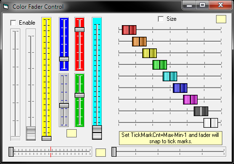



## Slider\_Mixer\_Control\_Upgrade\_3\.5

### Description

The original author of this code is Mike Payne. Kenneth Foster expanded his work, adding the horizontal style and several more properties.

Version 3.5: When drawing a new control, the code looks at the aspect ratio of the new control and sets the Style property accordingly. Toggling the Style property of the control swaps the width/height dimensions, thus preventing the control from shrinking to a small square as in previous versions.

Version 3.4: The Enable property has been added. I can't believe I overlooked that one. There is another zip file in the main zip file called FaderBW.zip. It is the same control as the main control except it does not have colored buttons. See the readme.txt in the zip file for more information.

Version 3.3: A non-fatal calculation error that only occurred when changing the style and button size while in the IDE has been fixed. The slider now has colored buttons.

Version 3.2: Thanks to ThePiper for pointing out a crash when using large values for Min/Max/Value. This has been fixed.

Version 3.1: I cleaned up the ReDraw, DrawPicAtValue, and OneIncrement code. The original tick marks would draw every n pixels. I changed them to be evenly spaced apart. By setting the TickMarkCnt = Max - Min - 1, the slider will snap to the tick marks.

Version 3.0: I added the Border on/off property, the Min property, corrected a minor bug in the border drawing procedure and added a little error checking when reading property values.
 
### More Info
 

             |
---                |---
**Submitted On**   |2012-08-06 12:57:06
**By**             |[Charles Kistler](https://github.com/Planet-Source-Code/PSCIndex/blob/master/ByAuthor/charles-kistler.md)
**Level**          |Intermediate
**User Rating**    |5.0 (30 globes from 6 users)
**Compatibility**  |VB 6\.0
**Category**       |[Custom Controls/ Forms/  Menus](https://github.com/Planet-Source-Code/PSCIndex/blob/master/ByCategory/custom-controls-forms-menus__1-4.md)
**World**          |[Visual Basic](https://github.com/Planet-Source-Code/PSCIndex/blob/master/ByWorld/visual-basic.md)
**Archive File**   |[Slider\_Mix222670862012\.zip](https://github.com/Planet-Source-Code/charles-kistler-slider-mixer-control-upgrade-3-5__1-74414/archive/master.zip)

